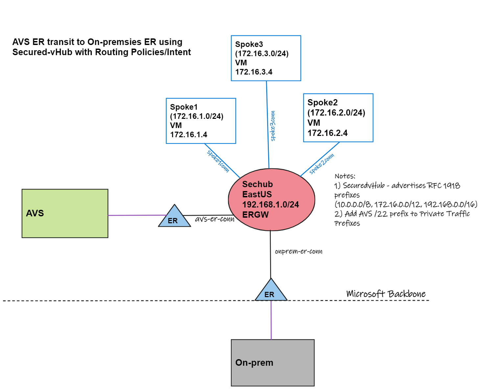

# Azure VMware Solution

Articles and labs

### LAB: AVS (ER) to On-prem (ER) transit using Secured-vhub+Routing Intent

Lab deployment script:

```bash
wget -O svh-avs-er-deploy.sh https://raw.githubusercontent.com/dmauser/azure-vmware-solution/main/svh-er-transit/svh-avs-er-deploy.azcli
chmod +xr svh-avs-er-deploy.sh
./svh-avs-er-deploy.sh
```

Default variables:

```Bash
#Parameters
region=eastus
rg=lab-svh-avs # set your Resource Group
vwanname=svh-avs # vWAN name
hubname=svhub # vHub name
username=azureuser # Username
password="Msft123Msft123" # Please change your password
vmsize=Standard_B1s # VM Size
firewallsku=Premium #Azure Firewall SKU Standard or Premium
```


#### Network diagram



#### Use cases

- ExpressRoute Local SKU.
- Lack of Global Reach feature.
- Traffic inspection between AVS and On-premises is required.

#### Considerations

- ExpressRoute Circuits are not created as part of this lab.
- After connecting the AVS ExpressRoute Circuit, go to Firewall Manager - Security Configuration and enable secure Internet Traffic to allow the default route (0.0.0.0/0) to be advertised to the AVS environment.
- Add AVS /22 prefix inside the Private traffic prefixes.

#### Field notes

- Review carefully all the considerations when enabling Routing Policies/Intent by reviewing [Virtual WAN Hub routing intent and routing policies - Troubleshooting data path](https://learn.microsoft.com/en-us/azure/virtual-wan/how-to-routing-policies#troubleshooting). Especially RFC 1918 prefixes (10.0.0.0/8, 172.16.0.0/12, 192.168.0.0/16) which are advertised by default from Secured-vHUB. In case the On-premises ExpressRoute circuit already advertises those prefixes, routing adjustments must be made before enabling Routing-Intent.
- Always onboard ExpressRoute circuits (including On-premises) after converting Secured-vHub and enabling Routing Policies/Intent. Otherwise, converting after it will have the default route (0.0.0.0/0) advertised to all connections. That will give you granular control on securing Internet traffic (the default route 0/0 advertisement).
